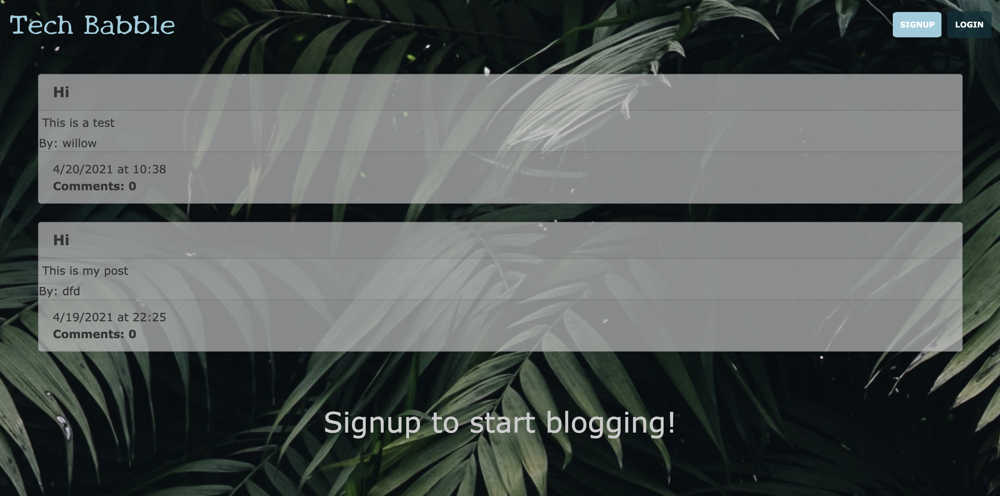

<h1 align="center"> Tech Babble! 👋 </h1> 

 

  ## Description
  Tech Babble is a developer blog app where users can signup for an account, login with their username and password, publish blog posts, comment on others' posts, and update or delete their own posts. This is a API app folling MVC development using MySQL with Sequeliz as an ORM and Handlebars for the front-end development. Express was used for routing along with Sequelize for accessing the API data, and Express-Session and bcrypt were used for user authentication.

 [Heroku Deployed App](https://tech-babble.herokuapp.com/)

  ## Table of Contents

  * [Description](#Description)
  * [Installation](#Installation)
  * [Usage](#Usage)
  * [Contribute](#Contribute) 
  * [Tech Used](#tech-used)
  * [License](#License)
  * [Questions](#Questions)

  ## Installation

  - Both Node.js and MySQL must be installed on your computer.
  - Clone the repo by copying and pasting in your command line.
  - Make sure to create database on MySQL before running.
  - Navigate to the server.js, run: 
    `npm install`
  - To start the server, run the following in your command line: 
    `npm start`
  - Navigate to `localhost:3001` in your browser to open the app locally.

  
     

  - You can also view the blog at my original post. Follow the link in the description.

  🚀 Demos:

  View the full demo on youtube, click on the link below.  
    
[My Youtube Demo!](https://youtu.be/nWJqI2Db67M)

  ## Tech Used

  - JavaScript
  - [Handlebars.js](https://handlebarsjs.com/)
  - [Node.js](https://nodejs.org/en/)
  - [Express.js](https://www.npmjs.com/package/express)
  - [Express-session](https://www.npmjs.com/package/express-session)
  - [bcrypt](https://www.npmjs.com/package/bcrypt)
  - [MySQL](https://dev.mysql.com/doc/)
  - [MySQL2](https://www.npmjs.com/package/mysql2)
  - [Sequelize](https://www.npmjs.com/package/sequelize)
  - [dotenv](https://www.npmjs.com/package/dotenv)
  - [Bulma](https://bulma.io/documentation/)
  
  ## Questions

  Please visit my 
   [GitHub profile](https://github.com/dorley1993/) to check out this and other projects I've created and contributed to.

  ## License  

    Copyright © Danielle Orley 

    licensed under MIT
